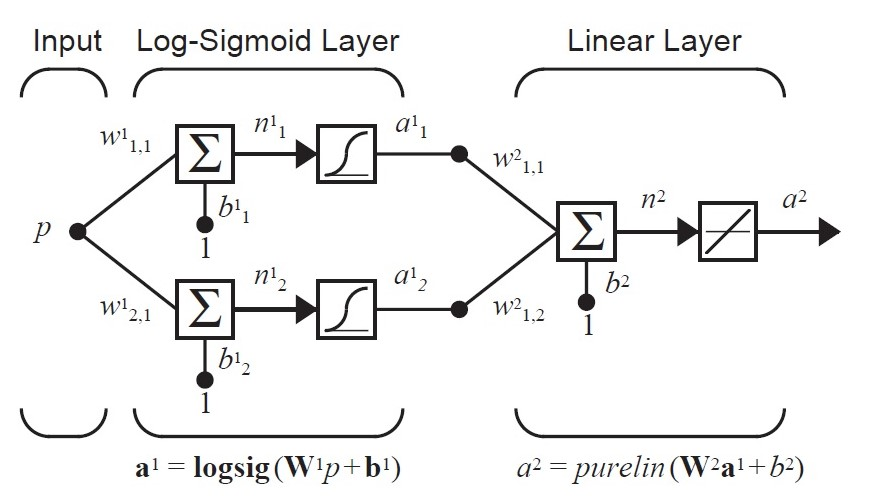
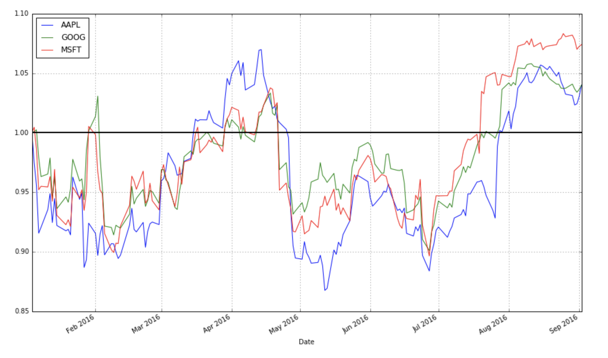
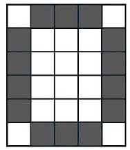
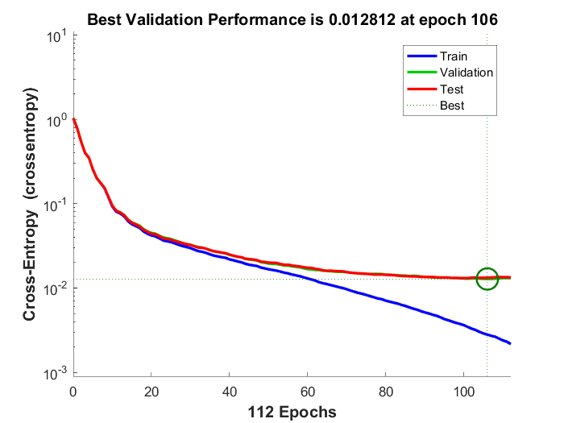
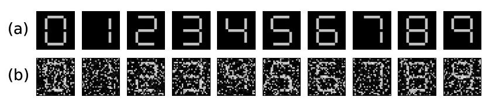

### ann-design

Advisor: Prof. C Prakash Vyasarayani.

#### 1. Function approxiamtion and time series analysis.

   
* Developed time series forecast model in Python, using ARIMA and LSTM models, studying sales data for furntiture dataset and risk and stock dividends of Apple and Tata(NSE India) datasets.
* Developed a network model with the LMS algorithm and multi-layers, studying network response for parameter changes. Used softmax and ReLU architectures for my final submission. 
* Performed comparative study of models designed with backpropagation, adaline and multi-layer models, BRNN etc. and tabulated the results.

 
> See the final commits in [time-series & func. approx folder](func_approx), for further details and code.

___

#### 2. Autoassociative memory models - digit recognition and pattern recovery.

* Developed models for pattern recognition of digits and extended this to extract from noisy images.
* Final model submission uses self-normalizing networks (seLU) for occluded, noisy images of aerodynamic component scans.
 * **Concept behind the model**: 
 * In an autoassociative memory the desired output vector is equal to the
input vector (i.e., tq = pq )

     
   This model is used to store a set of patterns and then to recall them, even when corrupted patterns are provided as inputs.  
   
     
   
   Sample image scanned above,  will have a prototype pattern : p1 = [–1 1 1 1 1 –1 1 –1 –1 –1 –1 1 1 –1 1 –1 ... 1] T
   
   The vector p1 corresponds to digit 0 (6 x 5 grid scan as illustrated below), p2 to digit 1, ....
   
   Using Hebb rule, weight matrix is calculated. Based on Supervised Learning rule, the code was developed.
   
   * The perfomance graph and validation function can be referred further, along with the codes and mnist.mat and other files.
   
   
   
   * The code was extended to extract patterns from noisy and occluded image scans. (illustration below)      
                     
        
     

   > See the final commits in [Supervised Hebbian learning](sup_hebb_learn) for further details and code.

____

#### 3. Multi-neuron and Multi-layer Perceptron Learning Models 
  
* Constructed models for lecture exercisess on perceptrons, supervised learning & backpropagation in Neural Networks coursework.
* For instance, the introductory session used perceptron models in Matlab. After studying rosenblatt model and previous network models, I designed a code to generate weights and bias for each iteration until convergence is achieved by cycling through the input vectors. ( [convergence_perceptron.m](percep/convergence_perceptron.m) )

* Method: 

    | p1 | p2 | p3 | p4 |
    | ------------- | ------------- | ------------- | ------------- |
    | 2	| 1	| -2 | -1 |
    | 2 | -2 | 2 | 1 |

     | Target values |
     | ------------- |
     | 0 |
     | 1 |
     | 0 |
     | 1 |

     Taking initial value as null for weight and bias, perceptron learning rule was applied and weights and bias were generated. W(0) = [0 0]T , b(0)=0.

    Weight values: w = [a b]T

* Results were generated by checking for convergence of the bias and weights, by checking for each vector to verify the learning rule.

    
    
___    

##### Footnotes: 
* Received a returning internship offer as Data Science Intern for the next summer with the team.
* Primary reference :  Neural Network Design by Demuth, H.B., Beale, M.H., De Jess, O. and Hagan, M.T., 2014.
* All sample codes and implementations, other models submitted for project are in the [perceptroncodes](https://github.com/govindarajula/perceptroncodes) repo.
* Refer this [post](https://www.kdnuggets.com/2019/05/understanding-backpropagation-applied-lstm.html) to understand backpropagation applied across the LSTM and then the BRNN apporach.
* Blog to refer for Stocks & Time Series: [link 1](https://ntguardian.wordpress.com/2018/07/17/stock-data-analysis-python-v2/), [link 2](https://www.machinelearningplus.com/time-series/time-series-analysis-python/)

