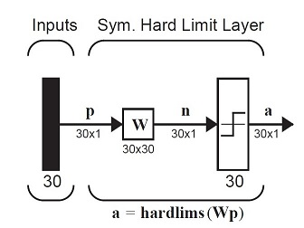
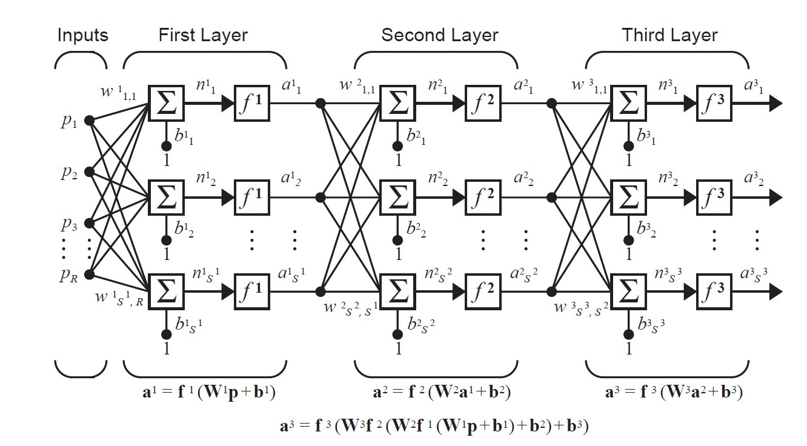

## ann-design 
 Repository with collection of final codes submitted for my summer internship at IIT Hyd.

Performed time series analysis for sales data and stocks usingARIMAandLSTMmodels for Apple and NSE India datasets.
Usedsoftmax, ReLUarchitectures for generative models and testing convergence of the forecasts (BRNN, Adaline-nets). Developedself-normalizingnetworks for pattern extraction from occluded, noisy images of aerodynamic component scans.◦Constructed models and instructed sessions on perceptrons, supervised learning & backpropagation for supplement exercises in Neural Networks lectures. 

### 1. Function approxiamtion and time series anlaysis.

   
* Developed time series forecast model in Python, using ARIMA and LSTM models, studying sales data for furntiture dataset and risk and stock dividends of Apple and NSE India datasets.
* Developed a network model with the LMS algorithm and multi-layers, studying network response for parameter changes.
* Performed comparative study of models designed with backpropagation, adaline and multi-layer models, BRNN etc. and tabulated the results.
> See the final commits in [time series and func. approxiamtion folder](func_approx) for further details and code.

___

### 2. Autoassociative memory models - digit recognition and pattern recovery.

 * Developed a code for pattern recognition of digits and extended this to extract from noisy and occluded patterns as well. 
 ( [mnist_test_code.m](sup_hebb_learn/mnist_test_code.m) )
 * In an autoassociative memory the desired output vector is equal to the
input vector (i.e., tq = pq )

     
   This model is used to store a set of patterns and then to recall them, even when corrupted patterns are provided as inputs.  
   
     
   
   Sample image scanned above,  will have a prototype pattern : p1 = [–1 1 1 1 1 –1 1 –1 –1 –1 –1 1 1 –1 1 –1 ... 1] T
   
   The vector p1 corresponds to digit 0 (6 x 5 grid scan as illustrated below), p2 to digit 1, ....
   
   Using Hebb rule, weight matrix is calculated. Based on Supervised Learning rule, the code was developed.
   
   * The perfomance graph and validation function can be referred further, along with the codes and mnist.mat and other files.
   
   
   
   * The code was extended to extract patterns from noisy and occluded image scans. (illustration below)      
                     
        
     

   > See the final commits in [Supervised Hebbian learning](sup_hebb_learn) for further details and code.

____

### 3. Multi-neuron and Multi-layer Perceptron Learning Models 
  

* After studying rosenblatt model and previous network models, I designed a code to generate weights and bias for each iteration until convergence is achieved by cycling through the input vectors. ( [convergence_perceptron.m](percep/convergence_perceptron.m) )

* Method: 

    | p1 | p2 | p3 | p4 |
    | ------------- | ------------- | ------------- | ------------- |
    | 2	| 1	| -2 | -1 |
    | 2 | -2 | 2 | 1 |

     | Target values |
     | ------------- |
     | 0 |
     | 1 |
     | 0 |
     | 1 |

     Taking initial value as null for weight and bias, perceptron learning rule was applied and weights and bias were generated. W(0) = [0 0]T , b(0)=0.

    Weight values: w = [a b]T

* Results were generated by checking for convergence of the bias and weights, by checking for each vector to verify the learning rule.

    
    
___    

___
##### Footnotes: 
* Received a returning internship offer for next summer in Data Science position for the team.
* Primary reference :  Neural Network Design by Demuth, H.B., Beale, M.H., De Jess, O. and Hagan, M.T., 2014.
* All sample codes and implementations, other models submitted for project are in the [perceptroncodes](https://github.com/gvsakash/perceptroncodes) repo.

